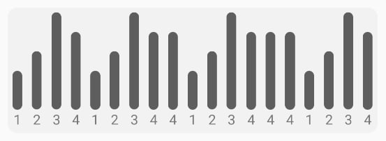
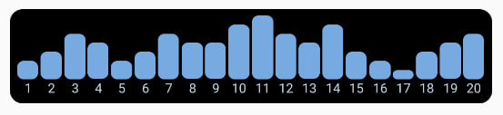
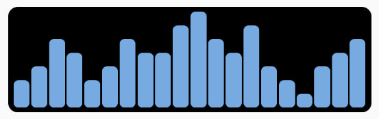

# Column Chart

Bare React Native minimalistic column chart

### Example of components with default properties



```tsx
import ColumnChart from './ColumnChart';

const data: any = [
  {value: 2, title: '1'},
  {value: 3, title: '2'},
  {value: 5, title: '3'},
  {value: 4, title: '4'},
];

return <ColumnChart data={data} />;
```

### Usage

Requires no additional libraries

### Properties

| Property        | Type     | Required | Description                                                       |
| --------------- | -------- | -------- | ----------------------------------------------------------------- |
| data            | Object[] | Yes      | Data that will render. Use [{value: number, title?: string}] type |
| containerStyles | Object   | No       | Styles for container                                              |
| columnStyles    | Object   | No       | Styles for columns                                                |
| titleStyles     | Object   | No       | Styles for titles                                                 |

### Example of using all styles properties



```tsx
import ColumnChart from './ColumnChart';

const data: any = [
  {value: 2, title: '1'},
  {value: 3, title: '2'},
  {value: 5, title: '3'},
  {value: 4, title: '4'},
  {value: 2, title: '5'},
  {value: 3, title: '6'},
  {value: 5, title: '7'},
  {value: 4, title: '8'},
  {value: 4, title: '9'},
  {value: 6, title: '10'},
  {value: 7, title: '11'},
  {value: 5, title: '12'},
  {value: 4, title: '13'},
  {value: 6, title: '14'},
  {value: 3, title: '15'},
  {value: 2, title: '16'},
  {value: 1, title: '17'},
  {value: 3, title: '18'},
  {value: 4, title: '19'},
  {value: 5, title: '20'},
];

return (
  <ColumnChart
    data={data}
    maxColumnHeight={50}
    titleStyles={{color: '#c5d6e8', fontSize: 10}}
    columnStyles={{backgroundColor: '#77aae0', width: '90%'}}
    containerStyles={{width: '92%', backgroundColor: '#000', padding: 5}}
  />
);
```

And without titles



```tsx
import ColumnChart from './ColumnChart';

const data: any = [
  {value: 2},
  {value: 3},
  {value: 5},
  {value: 4},
  {value: 2},
  {value: 3},
  {value: 5},
  {value: 4},
  {value: 4},
  {value: 6},
  {value: 7},
  {value: 5},
  {value: 4},
  {value: 6},
  {value: 3},
  {value: 2},
  {value: 1},
  {value: 3},
  {value: 4},
  {value: 5},
];

return (
  <ColumnChart
    data={data}
    maxColumnHeight={100}
    titleStyles={{color: '#c5d6e8', fontSize: 10}}
    columnStyles={{backgroundColor: '#77aae0', width: '90%'}}
    containerStyles={{width: '92%', backgroundColor: '#000', padding: 5}}
  />
);
```
